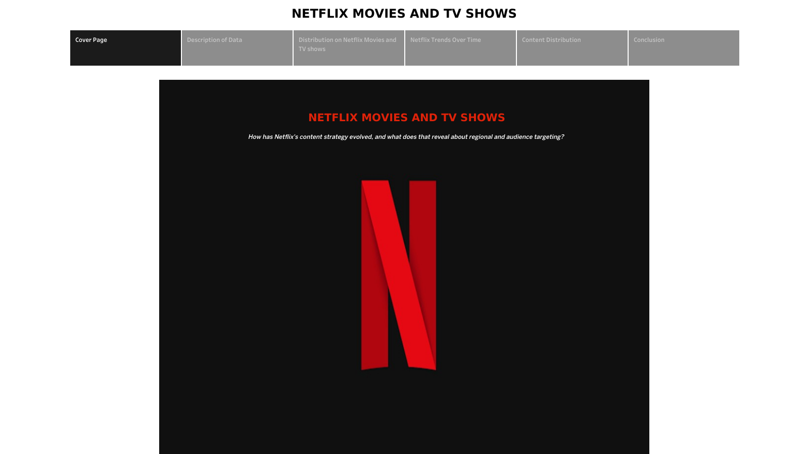

# Netflix Movies & TV Shows - Content Strategy Analysis

An interactive Tableau story exploring how Netflix's content catalog has evolved across content type, genre, maturity rating, and country - built to answer: **how has Netflix's content strategy evolved, and what does that reveal about audience and regional targeting?**

**[View the interactive dashboard on Tableau Public](https://public.tableau.com/views/Netflix_17888067069740/Story1?:language=en-US&publish=yes&:sid=&:redirect=auth&:display_count=n&:origin=viz_share_link)** 



## Overview

This project analyzes a Netflix content dataset to uncover patterns in content type, genre distribution, maturity ratings, and geographic spread, then visualizes those patterns as a 7-part Tableau Story designed to walk a viewer through the data narrative from context to conclusion.

## Dataset

- **Source:** [https://www.kaggle.com/datasets/shivamb/netflix-shows]
- **Size:** 6,236 observations, 19 variables
- **Key fields:** title, type (Movie/TV Show), release year, rating, duration, country of origin, genre/listed categories, date added to platform

## Tools Used

- Tableau Desktop / Tableau Public (dashboard design, story navigation, calculated fields, parameters)
- Microsoft Excel

## Story Structure

| Tab | What it shows |
|---|---|
| Cover Page | Project title and branding |
| Description of Data | Dataset summary and scope |
| Distribution on Netflix Movies and TV Shows | Genre breakdown, average duration by type, Movies vs TV Shows split |
| Netflix Trends Over Time | Content added by rating, growth in titles added by year |
| Content Distribution | Titles by country (map), genre distribution by country, Movies vs TV Shows by country |
| Conclusion | Summary of key findings |
| Acknowledgements | Data source and credits |

## Key Insights

- **Content mix:** Movies outnumber TV Shows in count, but TV Shows drive more total viewing time due to their episodic structure.
- **Growth pattern:** Netflix's sharpest catalog growth occurred between 2016-2019, coinciding with its global expansion and heavier investment in original content.
- **Content rating:** Mature-rated titles (TV-MA, TV-14) make up the majority of additions, signaling a shift toward an adult-skewing audience.
- **Geographic concentration:** The United States, India, and the United Kingdom lead in overall content volume, reflecting Netflix's largest and most established markets.
- **Regional variation:** Genre distribution differs significantly by country, pointing to localized content strategies rather than a one-size-fits-all catalog.

## Interactive Features

- **Top N sliders** to dynamically adjust how many genres/countries/years appear in each chart
- **Type filter** (Movie / TV Show / Both) applied across multiple views
- **Date granularity toggle** for the trends-over-time analysis
- Map tooltips and cross-filtering between the map, table, and country ranking chart

## Repo Structure

```
netflix-tableau-analysis/
├── README.md
├── LICENSE
├── netflix_dashboard.twbx      # Tableau packaged workbook
└── docs/
    ├── img1_cover.png
    ├── img2_description.png
    ├── img3_distribution.png
    ├── img4_trends.png
    ├── img5_content_distribution.png
    └── img6_conclusion.png
```

## License

This project's analysis, dashboard design, and code are shared under the [MIT License](LICENSE). The underlying dataset is sourced from [https://www.kaggle.com/datasets/shivamb/netflix-shows] and remains subject to its original license terms. "Netflix" and associated branding are trademarks of Netflix, Inc., used here for educational/portfolio purposes only.

## Author

Himavarsha Sreenivas
[LinkedIn](https://linkedin.com/in/himavarshas) | [GitHub](https://github.com/hima24)
